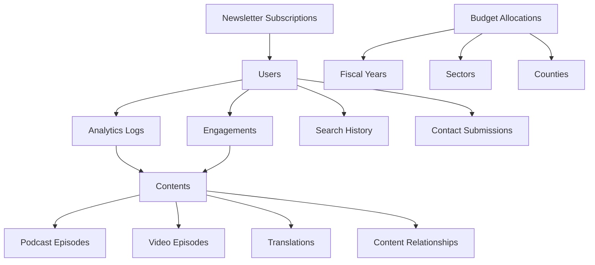
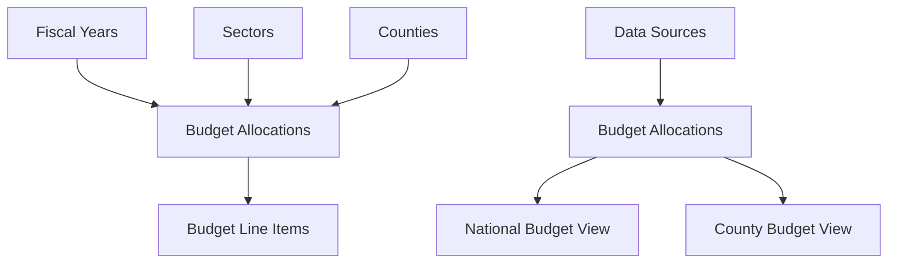
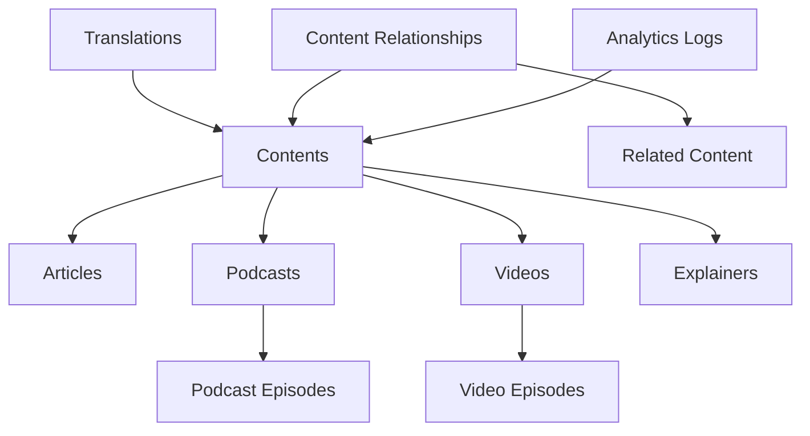
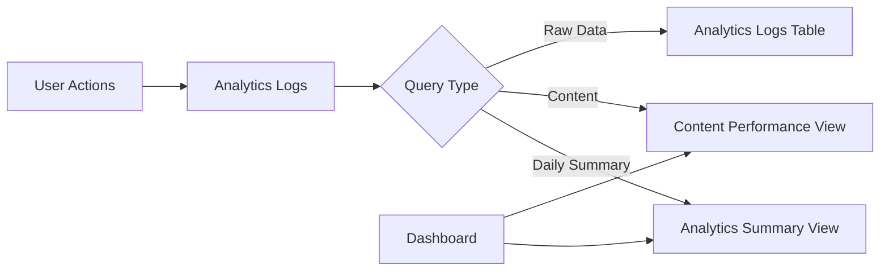
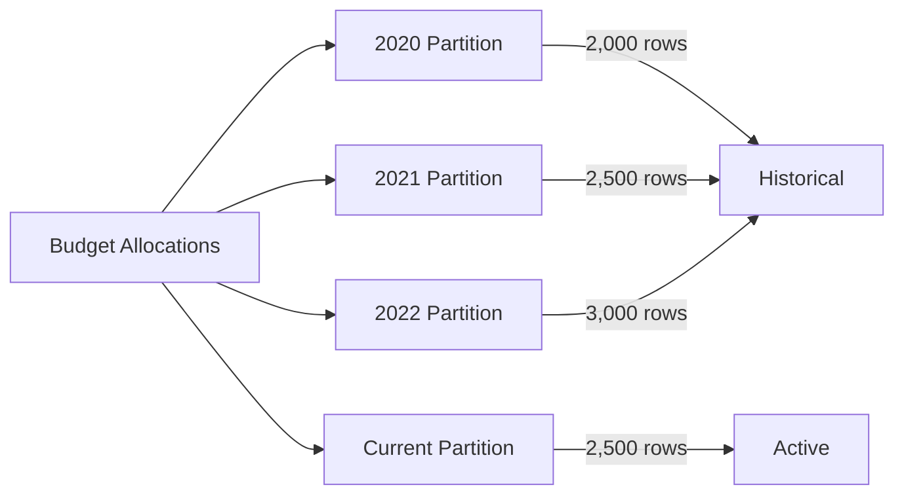
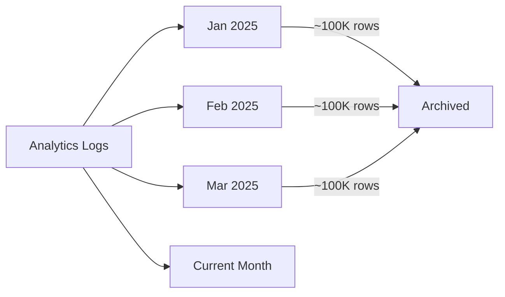

# Entity-Relationship Diagram

## Budget Ndio Story Database Schema

```mermaid
erDiagram
    %% =========================================================================
    %% CORE TABLES
    %% =========================================================================
    
    USERS {
        int id PK
        varchar email UK
        varchar name
        enum role
        jsonb preferences
        timestamp subscribed_at
        timestamp created_at
        timestamp updated_at
    }
    
    SECTORS {
        int id PK
        varchar name UK
        text description
        varchar icon_url
        varchar color_code
        int sort_order
        timestamp created_at
    }
    
    FISCAL_YEARS {
        int id PK
        int year UK
        date start_date
        date end_date
        text description
        boolean is_current
        timestamp created_at
    }
    
    COUNTIES {
        int id PK
        varchar name UK
        varchar code UK
        varchar region
        jsonb geo_data
        int population
        timestamp created_at
    }
    
    %% =========================================================================
    %% BUDGET DATA TABLES
    %% =========================================================================
    
    BUDGET_ALLOCATIONS {
        int id PK
        int fiscal_year_id FK
        int sector_id FK
        int county_id FK
        enum level
        decimal budgeted_amount
        decimal actual_spent
        decimal approved_amount
        text notes
        varchar source
        timestamp created_at
        timestamp updated_at
    }
    
    BUDGET_LINE_ITEMS {
        int id PK
        int allocation_id FK
        varchar description
        decimal budgeted_amount
        decimal actual_amount
        int quarter
        timestamp created_at
    }
    
    %% =========================================================================
    %% CONTENT TABLES
    %% =========================================================================
    
    CONTENTS {
        int id PK
        enum type
        varchar title
        varchar slug UK
        text description
        text content_body
        varchar media_url
        varchar thumbnail_url
        enum category
        text[] tags
        timestamp published_at
        varchar status
        int views
        boolean featured
        varchar author
        int duration_seconds
        jsonb analytics
        jsonb metadata
        timestamp created_at
        timestamp updated_at
    }
    
    TRANSLATIONS {
        int id PK
        int content_id FK
        enum language
        varchar translated_title
        text translated_body
        text translated_description
        text[] translated_tags
        timestamp created_at
        timestamp updated_at
    }
    
    CONTENT_CATEGORIES_REF {
        int id PK
        enum name UK
        text description
        varchar icon
        timestamp created_at
    }
    
    %% =========================================================================
    %% MEDIA TABLES
    %% =========================================================================
    
    PODCAST_EPISODES {
        int id PK
        int content_id FK
        int episode_number
        int season_number
        int duration_seconds
        varchar audio_url
        text transcript
        jsonb guests
        text shownotes
        timestamp created_at
        timestamp updated_at
    }
    
    VIDEO_EPISODES {
        int id PK
        int content_id FK
        varchar video_url
        varchar embed_url
        int duration_seconds
        varchar resolution
        int[] thumbnail_timestamps
        jsonb subtitles
        text transcript
        timestamp created_at
        timestamp updated_at
    }
    
    MEDIA_LIBRARY {
        int id PK
        varchar filename
        varchar original_filename
        varchar mime_type
        bigint size_bytes
        varchar url
        varchar local_path
        varchar alt_text
        text caption
        int uploaded_by
        timestamp created_at
    }
    
    %% =========================================================================
    %% ENGAGEMENT TABLES
    %% =========================================================================
    
    ENGAGEMENTS {
        int id PK
        int user_id FK
        enum type
        jsonb details
        inet ip_address
        text user_agent
        timestamp created_at
    }
    
    NEWSLETTER_SUBSCRIPTIONS {
        int id PK
        varchar email UK
        varchar name
        text[] interests
        boolean is_active
        timestamp subscribed_at
        timestamp unsubscribed_at
        varchar source
    }
    
    CONTACT_SUBMISSIONS {
        int id PK
        varchar name
        varchar email
        varchar subject
        text message
        varchar status
        int assigned_to
        text notes
        timestamp created_at
        timestamp updated_at
    }
    
    FAQS {
        int id PK
        varchar question
        text answer
        varchar category
        int sort_order
        boolean is_active
        timestamp created_at
        timestamp updated_at
    }
    
    %% =========================================================================
    %% ANALYTICS TABLES
    %% =========================================================================
    
    ANALYTICS_LOGS {
        bigint id PK
        int user_id FK
        varchar session_id
        int content_id FK
        enum event_type
        jsonb event_data
        interval duration
        text page_url
        text referrer_url
        varchar device_type
        varchar browser
        varchar os
        varchar country
        varchar city
        inet ip_address
        timestamp timestamp
    }
    
    %% =========================================================================
    %% SEARCH & DISCOVERY
    %% =========================================================================
    
    SEARCH_HISTORY {
        int id PK
        int user_id FK
        varchar session_id
        text query
        int results_count
        int clicked_content_id
        timestamp created_at
    }
    
    CONTENT_RELATIONSHIPS {
        int id PK
        int content_id FK
        int related_content_id FK
        varchar relationship_type
        timestamp created_at
    }
    
    %% =========================================================================
    %% UTILITY TABLES
    %% =========================================================================
    
    DATA_SOURCES {
        int id PK
        varchar name
        text description
        varchar url
        varchar source_type
        timestamp last_fetched
        timestamp created_at
    }
    
    SYSTEM_CONFIG {
        int id PK
        varchar config_key UK
        text config_value
        text description
        timestamp updated_at
    }
    
    %% =========================================================================
    %% RELATIONSHIPS
    %% =========================================================================
    
    %% Budget Allocations Relationships
    BUDGET_ALLOCATIONS }o--|| FISCAL_YEARS : "belongs to"
    BUDGET_ALLOCATIONS }o--|| SECTORS : "allocated to"
    BUDGET_ALLOCATIONS }o--|| COUNTIES : "county level"
    
    BUDGET_LINE_ITEMS }o--|| BUDGET_ALLOCATIONS : "belongs to"
    
    %% Content Relationships
    CONTENTS }o--|| CONTENT_CATEGORIES_REF : "categorized as"
    
    TRANSLATIONS }o--|| CONTENTS : "translates"
    
    PODCAST_EPISODES }o--|| CONTENTS : "enhances"
    VIDEO_EPISODES }o--|| CONTENTS : "enhances"
    
    %% User Relationships
    USERS ||--o{ ENGAGEMENTS : "generates"
    USERS ||--o{ SEARCH_HISTORY : "performs"
    USERS ||--o{ CONTACT_SUBMISSIONS : "submits"
    
    %% Analytics Relationships
    ANALYTICS_LOGS }o--|| USERS : "tracked"
    ANALYTICS_LOGS }o--|| CONTENTS : "views"
    
    %% Discovery Relationships
    CONTENT_RELATIONSHIPS }o--|| CONTENTS : "primary"
    CONTENT_RELATIONSHIPS }o--|| CONTENTS : "related"
    
    SEARCH_HISTORY }o--|| CONTENTS : "clicks"
```



---

## Database Schema Overview

### Core Entities



---

## Budget Data Flow



---

## Content Management Flow



---

## Analytics Pipeline



---

## Table Statistics

| Table Name | Est. Rows | Est. Size | Key Indexes |
|------------|-----------|-----------|-------------|
| users | 1,000+ | Small | email, role |
| sectors | 10 | Tiny | name |
| fiscal_years | 10 | Tiny | year |
| counties | 47 | Tiny | name, code |
| budget_allocations | 10,000+ | Medium | fiscal_year_id, sector_id |
| budget_line_items | 50,000+ | Medium | allocation_id |
| contents | 1,000+ | Small | type, category, slug |
| analytics_logs | 1,000,000+ | Large | timestamp, content_id |
| engagements | 10,000+ | Medium | type, user_id |
| translations | 2,000+ | Small | content_id, language |

---

## Partitioning Strategy

### Budget Allocations (Range by Year)



### Analytics Logs (Range by Month)



---

## Index Strategy

### Critical Indexes (Performance Impact)

```sql
-- Budget queries (most frequent)
CREATE INDEX idx_allocations_fiscal_sector_level 
ON budget_allocations(fiscal_year_id, sector_id, level);

-- Content queries (high traffic)
CREATE INDEX idx_contents_published_featured 
ON contents(published_at DESC) WHERE featured = true;

-- Analytics queries (large table)
CREATE INDEX idx_analytics_timestamp_event 
ON analytics_logs(timestamp DESC, event_type);
```

### Search Indexes

```sql
-- Full-text search on contents
CREATE INDEX idx_contents_search ON contents 
USING gin(to_tsvector('english', coalesce(title, '') || ' ' || coalesce(description, '')));

-- Trigram search for fuzzy matching
CREATE INDEX idx_contents_title_trgm ON contents 
USING gin(title gin_trgm_ops);
```

---

## Migration Path

### Phase 1: Basic Schema (Current)
- Core tables: users, sectors, fiscal_years, counties
- Budget tables: budget_allocations
- Basic content: contents, faqs

### Phase 2: Extended Features
- Add: podcast_episodes, video_episodes
- Add: translations, content_relationships
- Add: media_library

### Phase 3: Analytics & Scale
- Add: analytics_logs partitioning
- Add: search_history
- Add: data_sources tracking

---

## Foreign Key Reference

| Child Table | Foreign Key | Parent Table | Constraint |
|-------------|-------------|--------------|------------|
| budget_allocations | fiscal_year_id | fiscal_years | ON DELETE CASCADE |
| budget_allocations | sector_id | sectors | ON DELETE CASCADE |
| budget_allocations | county_id | counties | ON DELETE CASCADE |
| budget_line_items | allocation_id | budget_allocations | ON DELETE CASCADE |
| contents | (category) | content_categories_ref | FK via enum |
| translations | content_id | contents | ON DELETE CASCADE |
| podcast_episodes | content_id | contents | ON DELETE CASCADE |
| video_episodes | content_id | contents | ON DELETE CASCADE |
| engagements | user_id | users | ON DELETE SET NULL |
| analytics_logs | user_id | users | ON DELETE SET NULL |
| analytics_logs | content_id | contents | ON DELETE SET NULL |
| content_relationships | content_id | contents | ON DELETE CASCADE |
| content_relationships | related_content_id | contents | ON DELETE CASCADE |
| search_history | user_id | users | ON DELETE SET NULL |
| search_history | clicked_content_id | contents | ON DELETE SET NULL |
