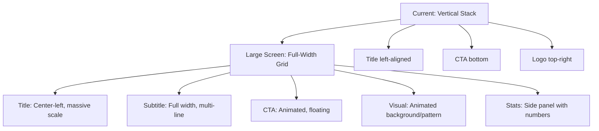
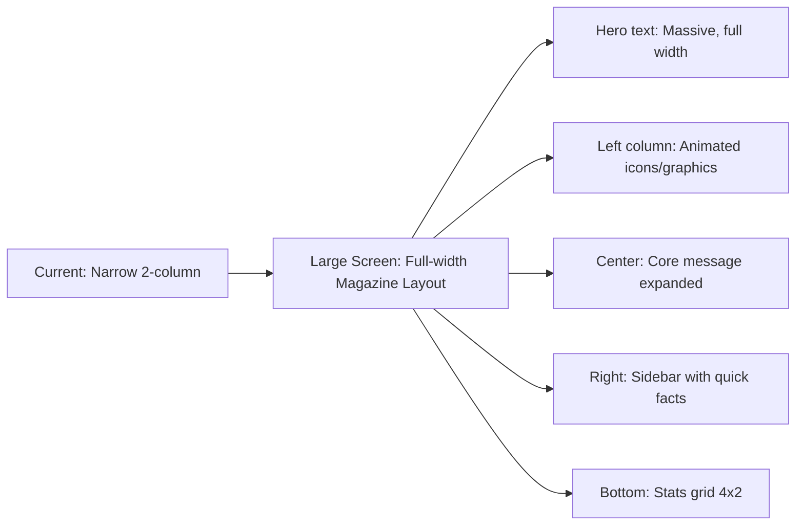
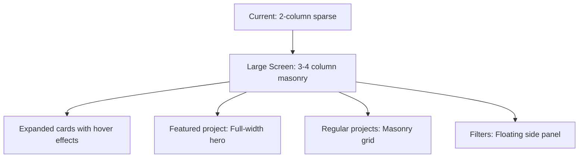
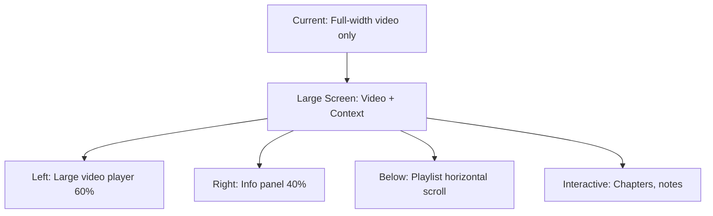
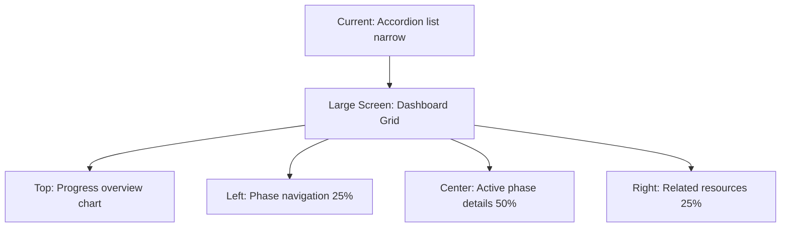

# Home Page Large Screen Redesign Plan

## Executive Summary

The current home page design is optimized for mobile devices (vertical stacking, responsive breakpoints) but underutilizes large screen real estate. This plan outlines a comprehensive redesign strategy to transform the home page into a visually compelling experience across all screen sizes while maintaining mobile excellence.

---

## Current State Analysis

### Breakpoint System (from `tailwind.config.ts`)

| Breakpoint | Range           |
| ---------- | --------------- |
| xm         | max 400px       |
| sm         | 401px - 768px   |
| md         | 769px - 1024px  |
| lg         | 1025px - 1490px |
| xl         | 1491px+         |

### Current Issues by Section

#### 1. Hero Section (`container/home-page/Hero.tsx`)

| Issue               | Current Code            | Problem                         |
| ------------------- | ----------------------- | ------------------------------- |
| Fixed padding       | `pl-[50px]`             | Doesn't scale for large screens |
| Fixed line heights  | `lgOnly:leading-[98px]` | Limited vertical scaling        |
| Fixed image size    | `w-[60px] h-[60px]`     | Too small on wide screens       |
| Underutilized space | 2-column layout only    | Half screen unused on xl        |
| CTA button spacing  | Fixed gaps              | Sparse layout                   |

#### 2. About Section (`container/home-page/About.tsx`)

| Issue              | Current Code            | Problem                       |
| ------------------ | ----------------------- | ----------------------------- |
| Fixed left padding | `pl-[50px]`             | Wasted horizontal space       |
| Two-column layout  | `w-[50%] smOnly:w-full` | Underutilizes wide screens    |
| Text-only content  | No visual anchors       | Empty space on large displays |
| Fixed margins      | `my-[50px] py-[20px]`   | Doesn't scale proportionally  |

#### 3. Projects Section (`container/home-page/Projects.tsx`)

| Issue               | Current Code  | Problem                         |
| ------------------- | ------------- | ------------------------------- |
| Narrow cards        | `w-[49%]`     | Half screen empty on xl         |
| Sparse grid         | 2 columns max | Could show 3-4 on xl            |
| Fixed padding       | `padding-x`   | Underutilizes width             |
| No visual hierarchy | Flat layout   | Missed engagement opportunities |

#### 4. Video Section (`container/home-page/Video.tsx`)

| Issue                   | Current Code     | Problem                         |
| ----------------------- | ---------------- | ------------------------------- |
| Fixed play button       | `w-[200px]`      | Too small on xl                 |
| Single video width      | `w-full`         | Could have side-by-side content |
| No contextual expansion | Isolated section | Lost real estate opportunity    |

#### 5. Clients/Budget Lifecycle (`container/home-page/Clients.tsx`)

| Issue          | Current Code       | Problem                     |
| -------------- | ------------------ | --------------------------- |
| Narrow content | `w-[50%]` columns  | Underutilizes width         |
| Accordion-only | Mobile-pattern     | Could expand on desktop     |
| Sparse layout  | Lots of whitespace | Empty feel on large screens |

---

## Design Principles for Large Screens

### 1. Fluid Typography Scale

```css
/* Recommended approach */
text-base = clamp(1rem, 0.5vw + 0.8rem, 1.25rem)
heading-1 = clamp(2rem, 2vw + 1.5rem, 5rem)
sub-heading = clamp(1.5rem, 1.5vw + 1rem, 3rem)
```

### 2. Proportional Spacing

- Use `vw` units for horizontal padding (5vw on xl, 3vw on lg)
- Use `vh` units for vertical spacing
- Scale margins with container width

### 3. Content Expansion Strategy

- **Mobile**: Single column, stacked
- **Tablet (md)**: Two columns
- **Laptop (lg)**: Two columns + side panels
- **Desktop (xl)**: Three to four columns, full-width sections

### 4. Visual Density

- Increase content density on large screens
- Add decorative elements (gradients, shapes)
- Implement horizontal rhythm with visual anchors

---

## Redesign Specifications by Section

### 1. Hero Section Redesign

#### Layout Transformation



#### Implementation Changes

| Element      | Current          | Redesigned                      |
| ------------ | ---------------- | ------------------------------- |
| Main heading | 1 line + flex    | 3-line stacked, massive scale   |
| Line height  | Fixed 98px on lg | Fluid: clamp(50px, 5vw, 130px)  |
| Padding      | pl-[50px]        | pl-[5vw] max-w-[1400px] mx-auto |
| CTA button   | Inline static    | Floating animated, larger       |
| Background   | Empty            | Animated gradient/shapes        |
| Stats panel  | None             | Add side panel with key metrics |
| Logo         | Small icon       | Full logo with animation        |

#### Large Screen Features

- **Parallax scrolling**: Hero elements at different speeds
- **Animated background**: Subtle motion patterns
- **Floating CTA**: Always visible, animated hover states
- **Stats dashboard**: Live counter showing budget facts
- **Interactive globe/map**: Kenya-focused visualization

---

### 2. About Section Redesign

#### Layout Transformation



#### Implementation Changes

| Element          | Current         | Redesigned                 |
| ---------------- | --------------- | -------------------------- |
| Heading position | pl-[50px]       | Full width, centered       |
| Layout           | 2 columns fixed | Grid: 1fr 2fr 1fr          |
| Text content     | 2 paragraphs    | 4 expanded paragraphs      |
| Visual elements  | None            | Animated icons, graphics   |
| Stats section    | None            | Add budget statistics grid |
| Interactive      | None            | Hover reveals, tooltips    |

#### Large Screen Features

- **Magazine layout**: Editorial style typography
- **Animated statistics**: Live counters for budget data
- **Icon grid**: Visual representations of concepts
- **Pull quotes**: Highlight key messages
- **Progress indicators**: Budget allocation visuals

---

### 3. Projects Section Redesign

#### Layout Transformation



#### Implementation Changes

| Element       | Current     | Redesigned               |
| ------------- | ----------- | ------------------------ |
| Card width    | w-[49%]     | w-[32%] lg, w-[24%] xl   |
| Grid columns  | 2           | 3 lg, 4 xl               |
| Card height   | Auto        | Varied masonry heights   |
| Hover effects | None        | Scale, reveal, animate   |
| Featured card | None        | First project full-width |
| Navigation    | Bottom only | Side filter panel        |

#### Large Screen Features

- **Masonry layout**: Pinterest-style grid
- **Hover reveals**: Extended descriptions
- **Live previews**: Video/image hover
- **Quick actions**: One-click expand
- **Filter sidebar**: Left-aligned, sticky

---

### 4. Video Section Redesign

#### Layout Transformation



#### Implementation Changes

| Element     | Current    | Redesigned                               |
| ----------- | ---------- | ---------------------------------------- |
| Play button | w-[200px]  | w-[120px] md, w-[150px] lg, w-[200px] xl |
| Layout      | Full-width | Split: 60% video, 40% info               |
| Playlist    | None       | Horizontal scroll below                  |
| Chapters    | None       | Interactive timeline                     |
| Notes       | None       | Side panel with resources                |

#### Large Screen Features

- **Theater mode**: Large video with controls
- **Chapter markers**: Clickable timeline
- **Resource sidebar**: Links, downloads
- **Playlist**: Horizontal scrolling thumbnails
- **Transcript**: Collapsible text panel

---

### 5. Clients/Budget Lifecycle Redesign

#### Layout Transformation



#### Implementation Changes

| Element    | Current        | Redesigned              |
| ---------- | -------------- | ----------------------- |
| Width      | padding-x      | Full-width with margins |
| Layout     | Accordion list | Grid dashboard          |
| Progress   | None           | Visual progress bar     |
| Navigation | In-row         | Left sidebar sticky     |
| Details    | Expand inline  | Full section reveal     |

#### Large Screen Features

- **Budget timeline**: Horizontal progress visualization
- **Interactive chart**: Click phases to explore
- **Resource panel**: Related content sidebar
- **Live data**: Connected to budget APIs
- **Export options**: PDF, CSV, share

---

## Implementation Roadmap

### Phase 1: Core Infrastructure (Day 1)

#### Tasks

1. Update `tailwind.config.ts` with new large-screen utilities
2. Create design tokens for fluid typography
3. Add CSS custom properties for spacing scale
4. Create reusable large-screen components

#### Deliverables

- Enhanced `tailwind.config.ts`
- `styles/globals.css` updates with fluid CSS
- `components/fluid/` directory with new components

---

### Phase 2: Hero Section (Day 2)

#### Tasks

1. Redesign Hero with fluid typography
2. Add animated background
3. Implement parallax scrolling
4. Add stats panel

#### Deliverables

- Updated `container/home-page/Hero.tsx`
- New `components/HeroStats.tsx`
- Animation system integration

---

### Phase 3: About Section (Day 3)

#### Tasks

1. Expand to magazine layout
2. Add animated statistics
3. Implement icon grid
4. Create pull quotes

#### Deliverables

- Updated `container/home-page/About.tsx`
- New `components/BudgetStats.tsx`
- Updated `constants/` with stats data

---

### Phase 4: Projects Section (Day 4)

#### Tasks

1. Implement masonry grid
2. Add hover effects
3. Create featured project card
4. Add filter sidebar

#### Deliverables

- Updated `container/home-page/Projects.tsx`
- New `components/ProjectMasonry.tsx`
- Updated `components/ProjectCard.tsx`

---

### Phase 5: Video Section (Day 5)

#### Tasks

1. Redesign with sidebar layout
2. Add playlist component
3. Implement chapters
4. Add resource panel

#### Deliverables

- Updated `container/home-page/Video.tsx`
- New `components/VideoSidebar.tsx`
- Updated `components/PlayVideo.tsx`

---

### Phase 6: Clients Section (Day 6)

#### Tasks

1. Redesign as budget dashboard
2. Add progress visualization
3. Implement sidebar navigation
4. Add live data connections

#### Deliverables

- Updated `container/home-page/Clients.tsx`
- New `components/BudgetTimeline.tsx`
- New `components/PhaseDetails.tsx`

---

### Phase 7: Testing & Polish (Day 7)

#### Tasks

1. Cross-browser testing
2. Performance optimization
3. Accessibility audit
4. Animation smoothness check

#### Deliverables

- Test report
- Performance benchmarks
- Accessibility compliance certificate

---

## Technical Considerations

### Performance

| Metric      | Target  | Strategy                     |
| ----------- | ------- | ---------------------------- |
| LCP         | < 2.5s  | Lazy load below-fold         |
| CLS         | < 0.1   | Reserve space for animations |
| FID         | < 100ms | Code-split animations        |
| Bundle size | < 300KB | Tree-shake GSAP/Framer       |

### Animation Strategy

```typescript
// Use useReducedMotion hook for accessibility
const shouldReduceMotion = useReducedMotion();

const animationConfig = {
  duration: shouldReduceMotion ? 0 : 0.8,
  ease: shouldReduceMotion ? "linear" : [0.86, 0, 0.07, 0.995],
};
```

### Responsive Image Strategy

```tsx
<OptimizedImage
  src={image}
  sizes="(max-width: 400px) 100vw, (max-width: 768px) 100vw, (max-width: 1024px) 50vw, 33vw"
  priority={isAboveFold}
/>
```

---

## Success Metrics

### Visual

- [ ] No empty space on xl screens
- [ ] Balanced visual hierarchy
- [ ] Engaging animation sequences
- [ ] Consistent typography scale

### Performance

- [ ] Lighthouse score 90+ on desktop
- [ ] Smooth 60fps animations
- [ ] Fast interactive responses

### User Experience

- [ ] Intuitive navigation on all screens
- [ ] Clear call-to-actions
- [ ] Accessible to keyboard/mouse users
- [ ] Responsive to reduced motion preferences

---

## Files to Modify

### New Files

```
components/fluid/
  HeroStats.tsx
  BudgetStats.tsx
  ProjectMasonry.tsx
  VideoSidebar.tsx
  BudgetTimeline.tsx
  PhaseDetails.tsx
```

### Modified Files

```
container/home-page/
  Hero.tsx
  About.tsx
  Projects.tsx
  Video.tsx
  Clients.tsx

tailwind.config.ts
styles/globals.css
components/ProjectCard.tsx
components/PlayVideo.tsx
```

---

## Questions & Decisions Needed

1. **Animation library preference**: Continue with Framer Motion or add GSAP?
2. **Budget data source**: Static JSON or live API connection?
3. **Image assets**: Need new graphics for large screen visuals?
4. **Color palette expansion**: Add large-screen specific gradients?
5. **Typography licensing**: Neue Montreal supports all weights needed?

---

## Approval Required

- [ ] Design direction approval
- [ ] Budget for any new assets
- [ ] Timeline acceptance
- [ ] Priority section order
