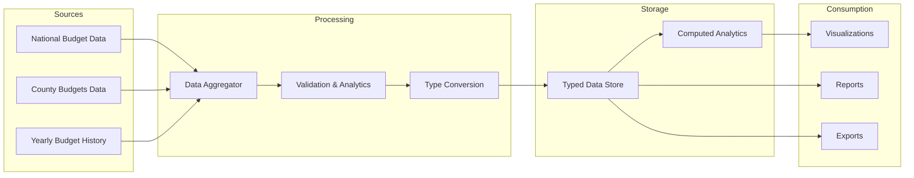

# KENYAN BUDGET DATACHAIN ARCHITECTURE PLAN

## Executive Summary

This document outlines the comprehensive architecture for a well-linked datachain that tracks and visualizes Kenya's national and county budgets. The system will feature in-depth data science analytics, rich visualizations (pie charts, bar graphs, line charts), and a fully revamped year selector that defaults to the latest Kenyan Budget.

---

## 1. System Architecture Overview

```mermaid
graph TB
    subgraph Data Layer
        MD[Mock Data - tracker-unified.json]
        TY[TypeScript Types]
        KS[Kenyan Budget Statistics]
    end

    subgraph Components Layer
        VC[Visualization Components]
        YS[Year Selector]
        DS[Data Science Components]
        UI[UI Framework Components]
    end

    subgraph Pages Layer
        TI[Tracker Index - National/County tabs]
        SD[Sector Detail - /tracker/sector/[slug]]
        YD[Year Detail - /tracker/[year]]
        ID[Project/Item Detail - /tracker/details/[id]]
    end

    subgraph Analytics Layer
        EA[Efficiency Analytics]
        TA[Trend Analysis]
        CA[Comparative Analytics]
    end

    MD --> TY
    TY --> VC
    TY --> DS

    VC --> YS
    VC --> SD
    VC --> ID

    DS --> SD
    DS --> YD

    YS --> TI
    YS --> SD
    YS --> YD

    TI --> SD
    TI --> YD
    SD --> ID
```

---

## 2. Data Chain Architecture

### 2.1 Data Flow Diagram



### 2.2 Data Hierarchy

```
Kenyan Budget
├── National Budget
│   ├── Education (Ksh 701-718B)
│   ├── Infrastructure & Energy (Ksh 500-554B)
│   ├── National Security (Ksh 251-279B)
│   ├── Debt Servicing (Ksh 1.2T)
│   └── Health (Ksh 147-153B)
│
├── County Budgets (47 Counties)
│   ├── Health (Ksh 380-400B)
│   ├── Agriculture (Equitable Share)
│   ├── ECDE & Vocational (Equitable Share)
│   ├── Local Infrastructure (Equitable Share)
│   └── Water & Sanitation (Equitable Share)
│
└── Historical Data (2000-Present)
    ├── Yearly breakdowns
    ├── Project-level data
    └── Performance metrics
```

---

## 3. Enhanced TypeScript Interfaces

### 3.1 Core Budget Types

```typescript
// Enhanced Budget Types for KNEYAN BUDGET

export interface KenyanBudget {
  year: number;
  fiscalYear: string;
  totalBudget: string;
  totalBudgetNumeric: number;
  currency: Currency;
  nationalBudget: NationalBudget;
  countyBudget: CountyBudget;
  historicalContext: HistoricalContext;
  analytics: BudgetAnalytics;
}

export interface NationalBudget {
  sectors: NationalSector[];
  totalAllocation: number;
  debtServicing: number;
  consolidatedFund: number;
  contingencies: number;
}

export interface CountyBudget {
  totalEquitableShare: number;
  conditionalGrants: number;
  ownRevenue: number;
  counties: CountyAllocation[];
}

export interface NationalSector {
  id: string;
  name: string;
  budget: string;
  budgetNumeric: number;
  percentageOfTotal: number;
  allocationStatus: AllocationStatus;
  subSectors: SubSector[];
  keyProjects: Project[];
  performanceMetrics: SectorPerformance;
  icon: string;
  description: string;
  timeline: string;
  impact: string;
  breakdown: string[];
}

export interface CountyAllocation {
  id: string;
  name: string;
  code: string;
  equitableShare: number;
  conditionalGrants: number;
  totalAllocation: number;
  population: number;
  perCapitaAllocation: number;
  keySectors: string[];
  performanceScore: number;
}

export interface Project {
  id: string;
  name: string;
  description: string;
  budget: string;
  allocatedPercentage: number;
  status: ProjectStatus;
  progress: number;
  beneficiaries: string;
  startDate: string;
  endDate?: string;
  location: {
    county: string;
    constituency: string;
    ward?: string;
  };
  contractor?: string;
  completionDate?: string;
}

export interface BudgetAnalytics {
  efficiencyScore: number;
  utilizationRate: number;
  completionRate: number;
  trendData: TrendData[];
  comparativeAnalysis: ComparativeAnalysis;
  projections: Projection[];
}

export interface TrendData {
  year: number;
  totalBudget: number;
  allocationBySector: Record<string, number>;
  inflationAdjusted: number;
  growthRate: number;
}

export interface ComparativeAnalysis {
  nationalVsCountyRatio: number;
  sectorRankings: SectorRanking[];
  yearOverYearGrowth: YearOverYearGrowth;
  regionalDisparities: RegionalDisparity[];
}

export interface Projection {
  year: number;
  projectedBudget: number;
  confidenceLevel: number;
  assumptions: string[];
  growthRate: number;
}
```

---

## 4. Visualization Components Architecture

### 4.1 Component Library

```
components/
├── visualizations/
│   ├── PieChart/
│   │   ├── BudgetAllocationPie.tsx
│   │   └── SectorDistributionPie.tsx
│   │
│   ├── BarChart/
│   │   ├── YearlyBudgetBar.tsx
│   │   ├── CountyComparisonBar.tsx
│   │   └── SectorPerformanceBar.tsx
│   │
│   ├── LineChart/
│   │   ├── BudgetTrendLine.tsx
│   │   └── AllocationHistoryLine.tsx
│   │
│   ├── AreaChart/
│   │   └── BudgetGrowthArea.tsx
│   │
│   └── Specialized/
│       ├── SankeyDiagram.tsx
│       ├── TreemapBudget.tsx
│       └── RadarChart.tsx
│
├── year-selector/
│   ├── YearSelectorDropdown.tsx
│   ├── YearSelectorTabs.tsx
│   └── YearSelectorCarousel.tsx
│
├── analytics/
│   ├── EfficiencyScoreCard.tsx
│   ├── TrendAnalysisCard.tsx
│   ├── ComparativeMetrics.tsx
│   └── ImpactAssessment.tsx
│
└── datachain/
    ├── BudgetHierarchy.tsx
    ├── LinkedNavigation.tsx
    └── DataFlowVisualization.tsx
```

### 4.2 Visualization Specifications

#### Pie Chart - Budget Allocation

- **Purpose**: Show sector-wise budget distribution
- **Interactivity**: Hover for details, click to drill down
- **Animations**: Smooth transitions, legend highlights
- **Colors**: Consistent with sector theme (blue for national, green for county)

#### Bar Chart - Year-over-Year Comparison

- **Purpose**: Compare budget allocations across years
- **Features**: Stacked bars, grouped comparisons, trend lines
- **Responsive**: Mobile-friendly with touch support

#### Line Chart - Budget Trends

- **Purpose**: Show budget evolution over time
- **Data Points**: 2000 to present (25+ years)
- **Features**: Multiple lines for different sectors, area fill under curves

#### Sankey Diagram - Fund Flow

- **Purpose**: Visualize money flow from sources to sectors to projects
- **Nodes**: Budget sources, sectors, sub-sectors, projects
- **Links**: Allocation paths with width proportional to amount

---

## 5. Revamped Year Selector Design

### 5.1 Year Selector Features

```typescript
interface YearSelectorConfig {
  defaultYear: number; // Auto-select latest (2024/25)
  minYear: number; // 2000
  maxYear: number; // Current fiscal year
  displayFormat: "FY" | "Calendar" | "Both";
  selectionMode: "dropdown" | "tabs" | "carousel" | "timeline";
  showComparison: boolean;
  quickSelect: {
    latest: boolean;
    decadeStart: boolean;
    recent5Years: boolean;
  };
}
```

### 5.2 Year Selector UI Variants

**Variant A: Timeline Slider**

```
┌─────────────────────────────────────────────────────────────────┐
│  2000    2005    2010    2015    2020    2024/25                │
│  ────────────────────────────────────────────────────────────  │
│  ◀━━━━━━━━━━━━━━━━━━━━━━━━━━━━━━━━━━━━━━━━━━━━━━━━━━━━━━━━━▶  │
│                                                                 │
│  [Latest Budget] [Compare with Previous] [Show 5-Year Trend]  │
└─────────────────────────────────────────────────────────────────┘
```

**Variant B: Tabbed Navigation**

```
┌────────────────────────────────────────────────────────────┐
│  📅 Select Budget Year                                      │
├────────────────────────────────────────────────────────────┤
│  ┌─────────┐  ┌─────────┐  ┌─────────┐  ┌─────────┐       │
│  │  2022/23│  │  2023/24│  │2024/25 ✅│  │  All    │       │
│  └─────────┘  └─────────┘  └─────────┘  └─────────┘       │
│                                                             │
│  💡 Showing Kenya's Budget for Fiscal Year 2024/25         │
└────────────────────────────────────────────────────────────┘
```

**Variant C: Interactive Carousel**

```
┌────────────────────────────────────────────────────────────┐
│                           ▲                                 │
│  ┌─────────────┐         │         ┌─────────────┐        │
│  │  2023/24    │    ◀    ■    ▶    │  2024/25    │        │
│  │ Ksh 3.6T    │              ▲    │ Ksh 4.0T ✅  │        │
│  └─────────────┘         │         └─────────────┘        │
│                           ▼                                 │
│                                                             │
│  [2024/25 Latest] [Compare 2023/24] [Historical Analysis]  │
└────────────────────────────────────────────────────────────┘
```

---

## 6. Data Science Analytics

### 6.1 Analytics Modules

#### Efficiency Score Calculator

```typescript
interface EfficiencyMetrics {
  overallScore: number; // 0-100
  budgetUtilizationRate: number; // Percentage of budget effectively used
  projectCompletionRate: number; // Percentage of projects completed
  costPerBeneficiary: number; // Budget efficiency per citizen
  timelinessScore: number; // On-time delivery percentage
  qualityIndex: number; // Outcome quality metrics
}

function calculateEfficiencyScore(
  budget: KenyanBudget,
  projects: Project[],
): EfficiencyMetrics {
  // Weighted scoring algorithm
  return {
    overallScore: weightedAverage([
      budgetUtilizationRate * 0.25,
      projectCompletionRate * 0.25,
      timelinessScore * 0.2,
      costPerBeneficiaryScore * 0.15,
      qualityIndex * 0.15,
    ]),
    budgetUtilizationRate,
    projectCompletionRate,
    costPerBeneficiary,
    timelinessScore,
    qualityIndex,
  };
}
```

#### Trend Analysis Engine

```typescript
interface TrendAnalysis {
  growthTrend: "increasing" | "stable" | "decreasing";
  averageGrowthRate: number;
  sectorTrends: Record<string, TrendData>;
  projectedNextYear: number;
  confidenceInterval: { min: number; max: number };
  anomalyDetection: Anomaly[];
}

function analyzeTrends(
  historicalData: TrendData[],
  currentBudget: KenyanBudget,
): TrendAnalysis {
  // Statistical analysis using linear regression
  // Anomaly detection using Z-score methodology
  // Seasonality analysis for fiscal patterns
}
```

#### Comparative Analytics

```typescript
interface ComparativeAnalysis {
  nationalVsCountyComparison: {
    nationalTotal: number;
    countyTotal: number;
    ratio: number;
    perCapitaComparison: Record<string, number>;
  };
  sectorRankings: {
    byBudget: SectorRank[];
    byEfficiency: SectorRank[];
    byImpact: SectorRank[];
  };
  historicalComparison: {
    yearOverYearChange: number;
    decadeGrowth: number;
    inflationAdjustedGrowth: number;
  };
}
```

---

## 7. Page Architecture

### 7.1 Tracker Index Page (`/tracker`)

```mermaid
graph TB
    subgraph Hero
        H[Hero Section - "See Where the Money Went"]
        D[Description - Visual Budget Tracker]
    end

    subgraph NationalSection
        NT[National Tab]
        NC[National Cards - Education, Infrastructure, Security, Debt]
    end

    subgraph CountySection
        CT[County Tab]
        CC[County Cards - Health, Agriculture, ECDE, Infrastructure]
    end

    subgraph YearNavigation
        YS[Year Selector - Defaults to 2024/25]
        YL[Year Link - "Browse by Year"]
    end

    H --> NT
    H --> CT
    NT --> NC
    CT --> CC
    NC --> YS
    CC --> YS
    YS --> YL
```

### 7.2 Sector Detail Page (`/tracker/sector/[slug]`)

**Revamped Layout with Enhanced Visualizations:**

```
┌─────────────────────────────────────────────────────────────────────┐
│  [Back to Tracker]                                                  │
├─────────────────────────────────────────────────────────────────────┤
│                                                                     │
│  ┌─────────────────────────────────────────────────────────────┐    │
│  │  📚  Education              Status: Allocated              │    │
│  │                                                             │    │
│  │  Ksh 701-718B • Education • Nationwide                     │    │
│  │                                                             │    │
│  │  [Pie Chart: Sector Breakdown]    [Line Chart: 5-Year Trend]│    │
│  └─────────────────────────────────────────────────────────────┘    │
│                                                                     │
│  ┌─────────────────────────────────────────────────────────────┐    │
│  │  📊 Budget Analytics                                          │    │
│  │                                                             │    │
│  │  Efficiency Score: ████████████░░ 82/100                    │    │
│  │  Utilization Rate: ████████████████░░ 94%                   │    │
│  │  Completion Rate:  ██████████████░░░░ 78%                    │    │
│  └─────────────────────────────────────────────────────────────┘    │
│                                                                     │
│  ┌─────────────────────────────────────────────────────────────┐    │
│  │  📈 Year-over-Year Comparison                                │    │
│  │                                                             │    │
│  │  [Bar Chart: 2020-2024 Comparison]                          │    │
│  │                                                             │    │
│  │  2020: Ksh 450B ████████░░░░░░░░░░░░░░░░░░░░░░░░░░░░░░░░░  │    │
│  │  2021: Ksh 520B █████████░░░░░░░░░░░░░░░░░░░░░░░░░░░░░░░░░  │    │
│  │  2022: Ksh 580B ███████████░░░░░░░░░░░░░░░░░░░░░░░░░░░░░░  │    │
│  │  2023: Ksh 650B █████████████░░░░░░░░░░░░░░░░░░░░░░░░░░░░░  │    │
│  │  2024: Ksh 710B █████████████████░░░░░░░░░░░░░░░░░░░░░░░░  │    │
│  └─────────────────────────────────────────────────────────────┘    │
│                                                                     │
│  ┌─────────────────────────────────────────────────────────────┐    │
│  │  🎯 Key Details & Impact                                     │    │
│  │                                                             │    │
│  │  Impact: 10M+ students supported                              │    │
│  │  Timeline: FY 2024/25                                        │    │
│  │  Breakdown: Teacher salaries (TSC), Free basic education...  │    │
│  └─────────────────────────────────────────────────────────────┘    │
│                                                                     │
│  ┌─────────────────────────────────────────────────────────────┐    │
│  │  📅 Year Selector                                             │    │
│  │                                                             │    │
│  │  ◀ 2020  2021  2022  2023  2024/25 ✅ ▶                      │    │
│  │                                                             │    │
│  │  [Compare with 2023/24] [View All Years]                    │    │
│  └─────────────────────────────────────────────────────────────┘    │
│                                                                     │
└─────────────────────────────────────────────────────────────────────┘
```

### 7.3 Year Detail Page (`/tracker/[year]`)

**Features:**

- Comprehensive yearly budget overview
- All sectors comparison
- National vs County breakdown
- Key projects list
- Year selector for navigation
- Historical context
- Performance metrics

---

## 8. Implementation Roadmap

### Phase 1: Foundation (Week 1)

- [ ] Extend TypeScript types for enhanced analytics
- [ ] Create comprehensive mockdata for 2024/25 budget
- [ ] Build base visualization components (PieChart, BarChart, LineChart)
- [ ] Implement year selector component

### Phase 2: Visualizations (Week 2)

- [ ] Add Sankey diagram for fund flow
- [ ] Build trend analysis charts
- [ ] Create comparative analytics components
- [ ] Implement efficiency scoring visualization

### Phase 3: Page Development (Week 3)

- [ ] Revamp sector detail page with new visualizations
- [ ] Enhance year selector integration
- [ ] Add data science analytics sections
- [ ] Implement responsive layouts

### Phase 4: Polish & Animation (Week 4)

- [ ] Add GSAP animations for charts
- [ ] Implement smooth transitions
- [ ] Add loading states and skeleton screens
- [ ] Test and validate all components

---

## 9. Technical Dependencies

### Required Packages

```json
{
  "dependencies": {
    "recharts": "^2.12.0", // Charts and visualizations
    "framer-motion": "^11.0.0", // Animations
    "lucide-react": "^0.563.0", // Icons
    "date-fns": "^3.0.0", // Date utilities
    "d3-scale": "^4.0.0", // Advanced scaling
    "d3-shape": "^3.0.0" // SVG path generation
  }
}
```

### Color Scheme

```typescript
const budgetColors = {
  national: {
    primary: "#1e40af", // Blue-800
    secondary: "#3b82f6", // Blue-500
    accent: "#60a5fa", // Blue-400
    background: "#eff6ff", // Blue-50
  },
  county: {
    primary: "#059669", // Emerald-600
    secondary: "#10b981", // Emerald-500
    accent: "#34d399", // Emerald-400
    background: "#ecfdf5", // Emerald-50
  },
  shared: {
    debt: "#dc2626", // Red-600
    completed: "#16a34a", // Green-600
    progress: "#ca8a04", // Yellow-600
    stalled: "#991b1b", // Red-800
    allocated: "#2563eb", // Blue-600
  },
};
```

---

## 10. Success Metrics

- **Responsive**: Fully functional on mobile, tablet, and desktop
- **Performance**: < 2s page load, smooth animations (60fps)
- **Accessibility**: WCAG 2.1 AA compliant
- **Analytics**: 5+ data science metrics per sector
- **Visualizations**: 10+ chart components
- **Navigation**: Seamless drill-down from national → sector → project

---

## 11. Next Steps

1. **Review and approve** this architectural plan
2. **Confirm budget data** accuracy for 2024/25
3. **Prioritize features** if timeline constraints exist
4. **Begin Phase 1 implementation** with TypeScript types and mockdata
