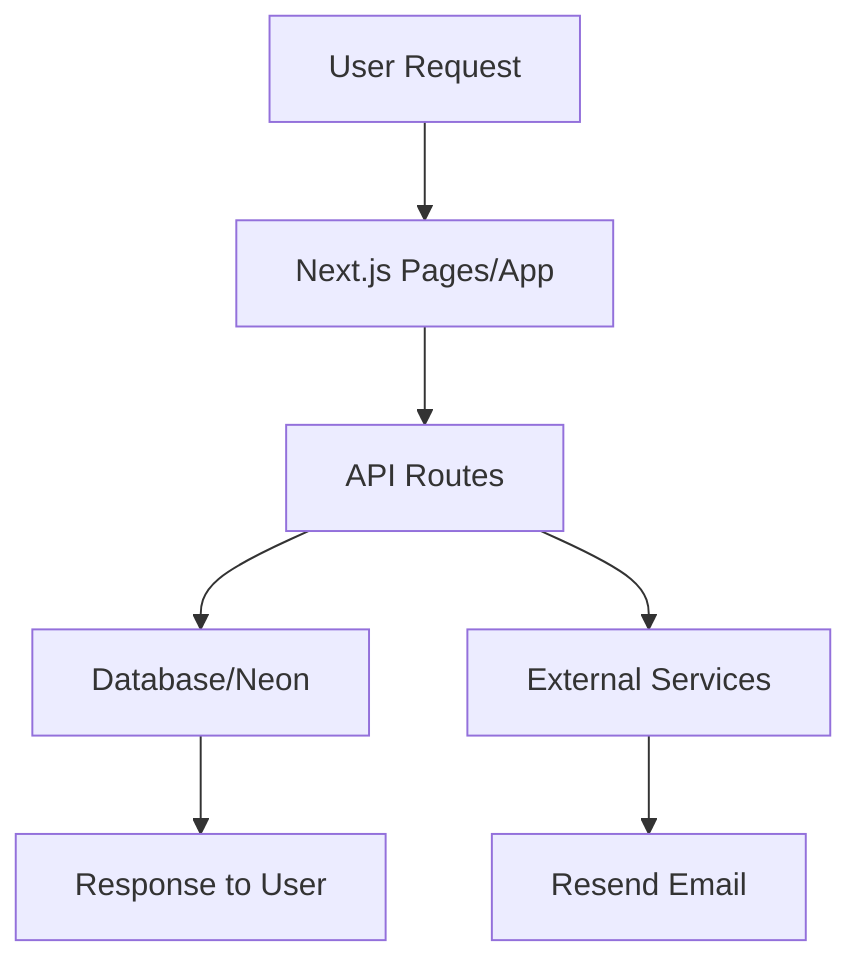

# Budget Ndio Story - Technical Documentation Plan

## Overview

This document outlines the comprehensive technical documentation package for the Budget Ndio Story platform. The documentation will cover API references, component library, code architecture, data structures, and integration guides.

---

## Project Summary

**Budget Ndio Story** is a Next.js-based civic engagement platform that transforms complex government budget data into accessible, youth-friendly content through storytelling, data visualizations, multimedia, and interactive tools.

### Technology Stack

- **Frontend**: Next.js 16+,, TypeScript
- **Styling**: Tailwind CSS
- **Animations**: GSAP, Framer Motion
- **Database**: PostgreSQL (Neon Serverless / Self-hosted)
- **Authentication**: NextAuth.js
- **Email**: Resend
- **Deployment**: Vercel / VPS with Nginx

---

## Documentation Structure

### 1. API Reference Documentation

#### 1.1 Blog API (`/api/blog`)

| Method | Endpoint | Description |
|--------|----------|-------------|
| GET | `/api/blog` | Fetch all blog posts with filtering |
| POST | `/api/blog` | Create a new blog post |
| GET | `/api/blog/[id]` | Get single blog post by ID |

**Query Parameters (GET)**:
- `status` - Filter by status (draft, published, all)
- `category` - Filter by category
- `search` - Search in title, excerpt, content

**Request Body (POST)**:
```typescript
{
  title: string;        // Required
  content: string;      // Required
  category: string;     // Required
  excerpt?: string;
  author?: string;
  tags?: string[];
  status?: 'draft' | 'published';
  featured?: boolean;
}
```

**Response Format**:
```typescript
{
  success: boolean;
  data: BlogPost[];
  total: number;
  timestamp: string;
}
```

#### 1.2 Subscribe API (`/api/subscribe`)

| Method | Endpoint | Description |
|--------|----------|-------------|
| POST | `/api/subscribe` | Subscribe to newsletter |

**Request Body**:
```typescript
{
  email: string;    // Required - validated as email
  name?: string;    // Optional
}
```

**Validation**: Zod schema with email validation
**Rate Limiting**: 5 requests per minute per IP
**Database**: Neon PostgreSQL `newsletter_subscriptions` table

#### 1.3 Unsubscribe API (`/api/unsubscribe`)

| Method | Endpoint | Description |
|--------|----------|-------------|
| POST | `/api/unsubscribe` | Unsubscribe from newsletter |

#### 1.4 Stories API (`/api/stories`)

| Method | Endpoint | Description |
|--------|----------|-------------|
| GET | `/api/stories` | Fetch all stories |
| POST | `/api/stories` | Submit a new story |

#### 1.5 Podcasts API (`/api/podcasts`)

| Method | Endpoint | Description |
|--------|----------|-------------|
| GET | `/api/podcasts` | Fetch all podcasts |
| POST | `/api/podcasts` | Submit podcast subscription/feedback |

#### 1.6 Tracker API (`/api/tracker`)

| Method | Endpoint | Description |
|--------|----------|-------------|
| GET | `/api/tracker` | Fetch budget tracker data |
| POST | `/api/tracker` | Submit new project/update |

#### 1.7 Participate API (`/api/participate`)

| Method | Endpoint | Description |
|--------|----------|-------------|
| POST | `/api/participate` | Submit participation form |

---

### 2. Component Library Documentation

#### 2.1 Core UI Components

| Component | Location | Description |
|-----------|----------|-------------|
| Button | `components/Button.tsx` | Reusable button with variants |
| Navbar | `components/Navbar.tsx` | Main navigation header |
| MobileNav | `components/MobileNav.tsx` | Mobile navigation menu |
| Footer | `components/Footer.tsx` | Main footer component |
| Heading | `components/Heading.tsx` | Typography component |
| Card | `components/ProjectCard.tsx` | Content card wrapper |
| Tags | `components/Tags.tsx` | Tag display component |

#### 2.2 Visualization Components

| Component | Location | Description |
|-----------|----------|-------------|
| BudgetBarChart | `components/visualizations/BudgetBarChart.tsx` | Bar chart for budget data |
| BudgetLineChart | `components/visualizations/BudgetLineChart.tsx` | Line chart for trends |
| BudgetPieChart | `components/visualizations/BudgetPieChart.tsx` | Pie chart for allocations |
| BudgetHeatmap | `components/visualizations/BudgetHeatmap.tsx` | Heatmap for geographic data |
| YearSelector | `components/year-selector/YearSelector.tsx` | Fiscal year filter |

#### 2.3 Media Components

| Component | Location | Description |
|-----------|----------|-------------|
| YouTubePlayer | `components/YouTubePlayer.tsx` | YouTube embed wrapper |
| SelfHostedVideoPlayer | `components/SelfHostedVideoPlayer.tsx` | Custom video player |
| VideoThumbnail | `components/VideoThumbnail.tsx` | Video thumbnail with overlay |
| VideoHero | `components/VideoHero.tsx` | Full-width video hero |

#### 2.4 Animation Components

| Component | Location | Description |
|-----------|----------|-------------|
| LinkHover | `animation/LinkHover.tsx` | Link hover effects |
| TextHover | `animation/TextHover.tsx` | Text hover animation |
| TextMask | `animation/TextMask.tsx` | Text mask reveal animation |
| PageAnimations | `animation/PageAnimations.tsx` | Page-level animations |

---

### 3. Code Architecture

#### 3.1 Project Structure

```
budgetndiostory/
├── app/                    # Next.js App Router
│   ├── api/               # API routes
│   ├── admin/             # Admin dashboard
│   └── auth/              # Authentication pages
├── pages/                  # Pages Router (legacy)
│   ├── home/
│   ├── tracker/
│   ├── learn/
│   ├── stories/
│   └── podcasts/
├── components/             # Reusable UI components
├── container/             # Page-specific component containers
├── constants/             # Configuration & constants
├── lib/                   # Utilities & helpers
├── types/                 # TypeScript type definitions
├── hooks/                 # Custom React hooks
├── mockdata/              # Mock data for development
├── database/              # Database schema & migrations
└── public/               # Static assets
```

#### 3.2 Route Structure

**Public Routes**:
- `/` - Home
- `/about` - About page
- `/contact` - Contact page
- `/privacy` - Privacy policy
- `/terms` - Terms of service

**Feature Routes**:
- `/tracker` - Budget tracker
- `/learn` - Educational content
- `/stories` - Stories/Blog
- `/podcasts` - Podcast episodes
- `/participate` - Civic participation

**Admin Routes**:
- `/admin` - Admin dashboard
- `/admin/content` - Content management
- `/admin/blog` - Blog management
- `/admin/subscribers` - Subscriber management

#### 3.3 Data Flow



---

### 4. Data Structures

#### 4.1 TypeScript Types

**Core Types** (`types/index.ts`):
- `TtextHoverProps` - Text hover animation props
- `TlogoMarqueeProps` - Logo marquee props
- `TLinkHoverProps` - Link hover props
- `TButtonProps` - Button props
- `TRoundedProps` - Rounded container props

**Blog Types** (`lib/blog-types.ts`):
- `BlogPost` - Blog post structure
- `BlogCategory` - Blog categories
- `BlogAuthor` - Author information

#### 4.2 Database Schema

See [`DATABASE_DOCUMENTATION.md`](../DATABASE_DOCUMENTATION.md) for detailed schema.

**Key Tables**:
- `users` - User accounts
- `budget_allocations` - Budget data
- `contents` - CMS content
- `newsletter_subscriptions` - Newsletter
- `analytics_logs` - User analytics
- `counties` - Kenya's 47 counties
- `sectors` - Budget sectors
- `fiscal_years` - Fiscal year management

---

### 5. Integration Guides

#### 5.1 External Services

| Service | Purpose | Configuration |
|---------|---------|---------------|
| Neon | Database | `DATABASE_URL` in .env |
| Resend | Email sending | `RESEND_API_KEY` in .env |
| NextAuth | Authentication | `NEXTAUTH_SECRET` in .env |

#### 5.2 Environment Variables

```env
# Database
DATABASE_URL=postgresql://...

# Authentication
NEXTAUTH_URL=http://localhost:3000
NEXTAUTH_SECRET=your-secret

# Email
RESEND_API_KEY=re_...
EMAIL_FROM=Budget Ndio Story <newsletter@budgetndiostory.com>

# Analytics
GA_MEASUREMENT_ID=G-...
```

---

### 6. Page Documentation

#### 6.1 Home Page (`/`)
- Hero section with video background
- Latest content sections
- Newsletter signup
- CTA strips

#### 6.2 Budget Tracker (`/tracker`)
- Sector-based budget visualization
- Year selector
- County/national toggle
- Budget line items tracking

#### 6.3 Learn (`/learn`)
- Educational modules
- Course progress tracking
- Interactive lessons

#### 6.4 Stories/Blog (`/stories`)
- Article listing with filters
- Category-based organization
- Featured content

#### 6.5 Podcasts (`/podcasts`)
- Episode listing
- Audio player
- Show notes

---

## Implementation Priority

| Priority | Documentation | Description |
|----------|---------------|-------------|
| 1 | API Reference | All endpoints with examples |
| 2 | Component Library | Core UI + visualizations |
| 3 | Architecture Overview | Project structure + patterns |
| 4 | Data Structures | Types + database |
| 5 | Integration Guides | External services |

---

## Notes

- Existing documentation: `PRD.md`, `DATABASE_DOCUMENTATION.md`, `ER_DIAGRAM.md`
- This documentation package complements existing materials
- Focus on actionable, developer-focused content
