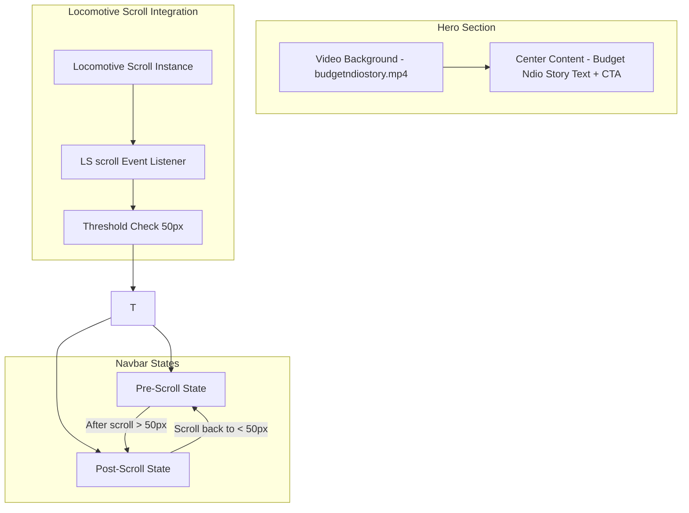

# Video Hero & Scroll-Triggered Navbar Implementation Roadmap

## Updated for Locomotive Scroll + GSAP Stack

## Overview

Transform the home page hero section to use a video background (`budgetndiostory.mp4`) while implementing a sophisticated scroll-triggered navbar that toggles between a minimal pre-scroll state and a full navbar post-scroll.

## Critical: Locomotive Scroll Compatibility

Your project uses **Locomotive Scroll** (virtual scrolling) which breaks native `window.addEventListener('scroll', ...)` events. The roadmap must use Locomotive's native scroll events instead.

### Why This Matters

```javascript
// ❌ This WILL NOT work with Locomotive Scroll
window.addEventListener('scroll', handleScroll);

// ✅ Use Locomotive's scroll event instead
scroll.on('scroll', (instance) => { ... });
```

## Architecture Diagram



## Implementation Steps

### Step 1: Add Video File

- Place `budgetndiostory.mp4` in `public/videos/` directory
- Recommended specs: MP4 format, optimized for web (<5MB), 1920x1080 resolution
- Add poster image: `public/videos/budgetndiostory-poster.jpg`

### Step 2: Create Locomotive-Compatible Scroll Hook

```typescript
// hooks/useLocomotiveScrollThreshold.ts
import { useState, useEffect, useContext } from "react";
import { LocomotiveScrollContext } from "@/components/SmoothScrollGsap";

export function useLocomotiveScrollThreshold(threshold: number = 50) {
  const [isScrolled, setIsScrolled] = useState(false);
  const scroll = useContext(LocomotiveScrollContext);

  useEffect(() => {
    if (!scroll || !scroll.on) return;

    const handleScroll = (instance: any) => {
      setIsScrolled(instance.scroll.y > threshold);
    };

    scroll.on("scroll", handleScroll);

    return () => {
      scroll.off("scroll", handleScroll);
    };
  }, [scroll, threshold]);

  return isScrolled;
}
```

### Step 3: Update SmoothScrollGsap for Navbar Integration

```typescript
// components/SmoothScrollGsap.tsx
// Add scroll state export for navbar consumption

interface LocomotiveScrollContextType {
  scroll: any;
  scrollTo: (target: string | number) => void;
}

export const LocomotiveScrollContext = createContext<LocomotiveScrollContextType | null>(null);

// In the component, expose scroll instance
useEffect(() => {
  if (!isReady) return;

  const scrollInstance = new LocomotiveScroll({
    // ... existing config
  });

  setScroll(scrollInstance);

  return () => {
    scrollInstance.destroy();
  };
}, [isReady]);

// Expose to context
return (
  <LocomotiveScrollContext.Provider value={{ scroll: scrollInstance, scrollTo: scrollInstance.scrollTo }}>
    {children}
  </LocomotiveScrollContext.Provider>
);
```

### Step 4: Create Video Hero Component

```typescript
// components/VideoHero.tsx
'use client';
import { motion } from 'framer-motion';
import Link from 'next/link';
import { ArrowUpRight } from 'lucide-react';

export default function VideoHero() {
  return (
    <section
      className="relative w-full h-screen overflow-hidden"
      data-scroll
      data-scroll-speed="-.3"
    >
      {/* Video Background */}
      <video
        autoPlay
        loop
        muted
        playsInline
        poster="/videos/budgetndiostory-poster.jpg"
        className="absolute top-0 left-0 w-full h-full object-cover"
      >
        <source src="/videos/budgetndiostory.mp4" type="video/mp4" />
      </video>

      {/* Overlay */}
      <div className="absolute top-0 left-0 w-full h-full bg-black/40" />

      {/* Content */}
      <div
        className="relative z-10 h-full flex flex-col justify-center items-center"
        data-scroll
        data-scroll-speed=".1"
      >
        <motion.h1
          initial={{ opacity: 0, y: 30 }}
          animate={{ opacity: 1, y: 0 }}
          transition={{ duration: 1, delay: 0.2 }}
          className="text-[#ffffff] text-center heading tracking-[-1.3px] font-semibold font-FoundersGrotesk uppercase"
        >
          Budget Ndio Story
        </motion.h1>

        <motion.div
          initial={{ opacity: 0, y: 20 }}
          animate={{ opacity: 1, y: 0 }}
          transition={{ duration: 0.8, delay: 0.6 }}
          className="mt-8"
        >
          <Link
            href="/learn"
            className="flex items-center gap-[5px] group"
          >
            <div className="rounded-[50px] border border-white/60 group-hover:bg-white py-[3px] px-[12px] cursor-pointer">
              <span className="paragraph font-NeueMontreal text-white uppercase group-hover:text-black transition-all">
                Start Learning
              </span>
            </div>
            <div className="w-[33px] flex items-center justify-center h-[33px] border border-white/60 rounded-full p-[1px] group-hover:bg-white transition-all">
              <ArrowUpRight size={24} className="text-white group-hover:text-black" />
            </div>
          </Link>
        </motion.div>
      </div>
    </section>
  );
}
```

### Step 5: Enhanced Navbar with Dual States

**Pre-Scroll State:**

- Display: "Budget Ndio Story" text (left-aligned)
- Single CTA button (right-aligned: "Start Learning")
- Transparent background
- Font: Neue Montreal or Founders Grotesk

**Post-Scroll State:**

- Full navigation items (Home, Blog, Tracker, Contact)
- Logo image display
- Backdrop blur effect (`backdrop-blur-[7px]`)
- Background color (semi-transparent)

```typescript
// components/Navbar.tsx
'use client';
import { useContext } from 'react';
import { motion } from 'framer-motion';
import { TextHover } from '@/animation';
import { navbarItems } from '@/constants';
import { logo } from '@/public';
import { navVariants } from '@/motion';
import { LocomotiveScrollContext } from '@/components/SmoothScrollGsap';
import Image from 'next/image';
import Link from 'next/link';

export default function Navbar() {
  const { scroll } = useContext(LocomotiveScrollContext) || { scroll: null };
  const [isScrolled, setIsScrolled] = useState(false);

  useEffect(() => {
    if (!scroll) return;

    const handleScroll = (instance: any) => {
      setIsScrolled(instance.scroll.y > 50);
    };

    scroll.on('scroll', handleScroll);
    return () => scroll.off('scroll', handleScroll);
  }, [scroll]);

  return (
    <>
      {/* Pre-Scroll State */}
      <motion.nav
        variants={navVariants}
        className={`fixed top-0 left-0 w-full h-[8vh] px-[50px] flex items-center justify-between z-50 transition-all duration-500 ${
          isScrolled ? 'opacity-0 pointer-events-none' : 'opacity-100'
        }`}
        animate={isScrolled ? 'hidden' : 'visible'}
      >
        <div>
          <span className="text-white text-xl font-bold font-FoundersGrotesk">
            Budget Ndio Story
          </span>
        </div>
        <Link
          href="/learn"
          className="flex items-center gap-[5px] group"
        >
          <div className="rounded-[50px] border border-white/60 group-hover:bg-white py-[3px] px-[12px] cursor-pointer">
            <span className="paragraph font-NeueMontreal text-white uppercase group-hover:text-black transition-all">
              Start Learning
            </span>
          </div>
        </Link>
      </motion.nav>

      {/* Post-Scroll State */}
      <motion.nav
        variants={navVariants}
        className={`fixed top-0 left-0 w-full h-[8vh] padding-x z-50 transition-all duration-500 ${
          isScrolled ? 'opacity-100 pointer-events-auto' : 'opacity-0 pointer-events-none'
        }`}
        animate={isScrolled ? 'visible' : 'hidden'}
      >
        <div className="w-full backdrop-blur-[7px] flex items-center justify-between">
          <div className="w-[50%]">
            <Link href={"/"}>
              <Image
                src={logo}
                alt="Budget Ndio Story logo"
                width={70}
                height={70}
                priority
              />
            </Link>
          </div>
          <div className="flex gap-x-[20px] w-[50%]">
            {navbarItems.map((item) => (
              <Link
                key={item.id}
                className={`w-fit paragraph font-medium font-NeueMontreal text-white capitalize flex flex-col hover`}
                href={item.href}
              >
                <TextHover titile1={item.title} titile2={item.title} />
              </Link>
            ))}
          </div>
        </div>
      </motion.nav>

      {/* Mobile Navigation */}
      <MobileNav />
    </>
  );
}
```

### Step 6: Update Motion Variants

```typescript
// lib/motion.ts
export const navVariants = {
  visible: {
    y: 0,
    opacity: 1,
    transition: {
      duration: 0.4,
      ease: [0.86, 0, 0.07, 0.995],
    },
  },
  hidden: {
    y: "-100%",
    opacity: 0,
    transition: {
      duration: 0.4,
      ease: [0.86, 0, 0.07, 0.995],
    },
  },
};
```

## File Changes Required

| File                                       | Action | Description                       |
| ------------------------------------------ | ------ | --------------------------------- |
| `public/videos/budgetndiostory.mp4`        | Add    | Video file for hero background    |
| `public/videos/budgetndiostory-poster.jpg` | Add    | Poster image for video            |
| `hooks/useLocomotiveScrollThreshold.ts`    | Create | Locomotive-compatible scroll hook |
| `components/VideoHero.tsx`                 | Create | Video background hero component   |
| `components/SmoothScrollGsap.tsx`          | Modify | Export scroll context for navbar  |
| `components/Navbar.tsx`                    | Modify | Add dual-state scroll behavior    |
| `lib/motion.ts`                            | Create | Add nav animation variants        |
| `container/home-page/Hero.tsx`             | Modify | Replace with VideoHero component  |

## Responsive Behavior

| Breakpoint | Pre-Scroll      | Post-Scroll     |
| ---------- | --------------- | --------------- |
| xl / lg    | Full text + CTA | Full navbar     |
| md         | Full text + CTA | Full navbar     |
| sm / xm    | Mobile nav only | Mobile nav only |

## Accessibility Considerations

1. `prefers-reduced-motion` media query for reduced animations
2. Keyboard navigation for CTA button
3. ARIA labels for navigation items
4. Video must have `muted` attribute for autoplay support
5. Ensure sufficient color contrast for white text on video

## Performance Optimizations

1. Add poster image for video (loads before video)
2. Use `playsInline` for mobile video support
3. Consider video compression and webm fallback
4. Lazy load non-critical assets

## Testing Checklist

- [ ] Video autoplays on page load
- [ ] Video pauses when not in viewport (optional)
- [ ] Navbar transitions smoothly at 50px scroll threshold
- [ ] Pre-scroll state shows correct content
- [ ] Post-scroll state shows full navbar
- [ ] Mobile navigation works correctly
- [ ] Reduced motion preference respected
- [ ] All breakpoints render correctly
